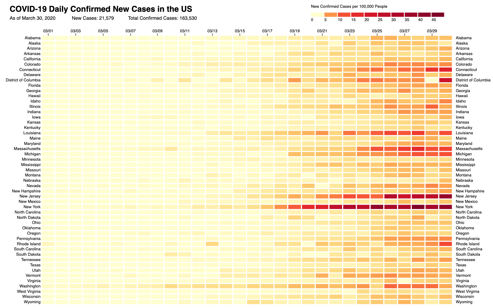

# CoVis
Heatmap created with [D3.js](https://d3js.org/) in which color visually encodes the number of new confirmed COVID-19 cases per 100,000 people in each US state per day. Data is sourced from [The New York Times](https://www.nytimes.com/interactive/2020/us/coronavirus-us-cases.html), based on reports from state and local health agencies. Data is updated daily. Inspiration provided by [these graphics](http://graphics.wsj.com/infectious-diseases-and-vaccines/) created by the WSJ.



## To view :
This visualization is packaged up in a Flask app and deployed on Heroku at https://covis-19.herokuapp.com/.

## To run it yourself:
To run this app and render the D3 in a browser on your local machine, clone the repo and run the following from the command line within the CoVis directory:

```
virtualenv venv
source venv/bin/activate
pip install -r requirements.txt
python app.py
```

The Flask app will serve the visualization on a port on your machine, typically 5000. Navigate to `localhost:5000` in a web browser to view the visualization. Feel free to make changes to `vis.js` to customize the visualization.